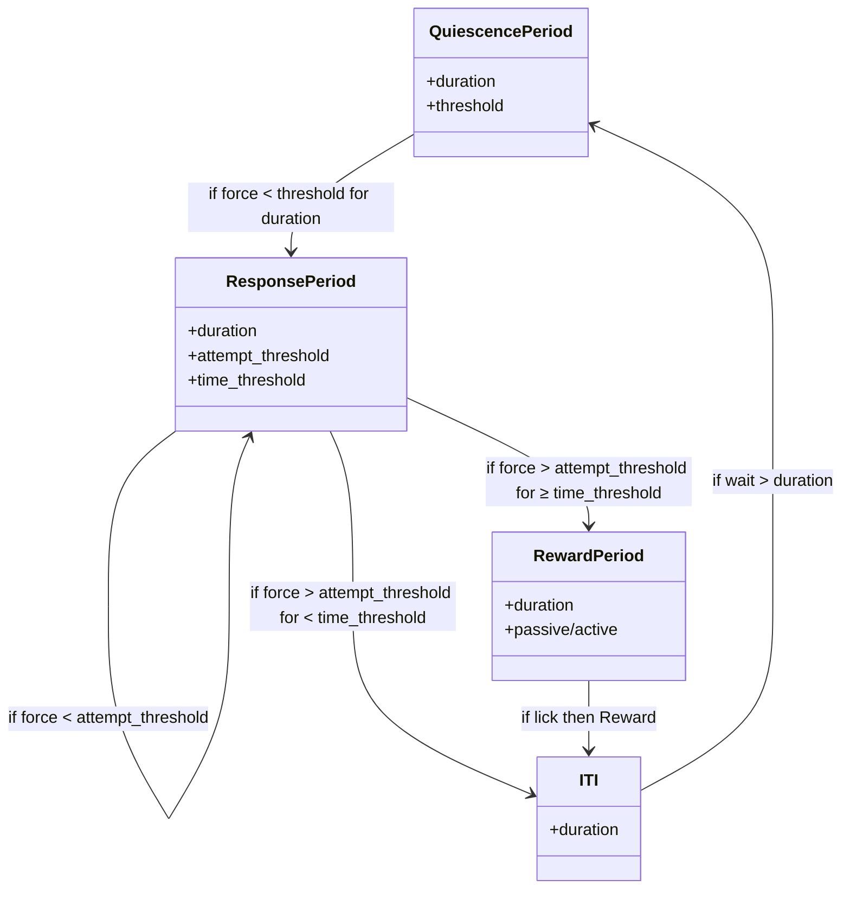

# aind-iso-force


[](https://pypi.org/project/aind-behavior-iso-force/)
[](LICENSE)
[](https://github.com/astral-sh/ruff)
[](https://github.com/astral-sh/uv)

A repository for the IsoForce task.

---

## 📋 General instructions

This repository follows the project structure laid out in the [Aind.Behavior.Services repository](https://github.com/AllenNeuralDynamics/Aind.Behavior.Services).

---

## 🔧 Prerequisites

[Pre-requisites for running the project can be found here](https://allenneuraldynamics.github.io/Aind.Behavior.Services/articles/requirements.html).

---

## 🚀 Deployment

For convenience, once third-party dependencies are installed, `Bonsai` and `python` virtual environments can be bootstrapped by running:

```powershell
./scripts/deploy.ps1
```

from the root of the repository.

## ⚙️ Generating settings files

The IsoForce task is instantiated by a set of three settings files that strictly follow a DSL schema. These files are:
- `task_logic.json`
- `rig.json`
- `session.json`

Examples on how to generate these files can be found in the `./Examples` directory of the repository. Once generated, these are the the only required inputs to run the Bonsai workflow in `./src/main.bonsai`.

The workflow can thus be executed using the [Bonsai CLI](https://bonsai-rx.org/docs/articles/cli.html):

```powershell
"./bonsai/bonsai.exe" "./src/main.bonsai" -p SessionPath=<path-to-session.json> -p RigPath=<path-to-rig.json> -p TaskLogicPath=<path-to-task_logic.json>
```

However, for a better experiment management user experience, it is recommended to use the provided experiment launcher below.

## [> ] CLI tools

The platform exposes a few CLI tools to facilitate various tasks. Tools are available via:

```powershell
uv run iso-force <subcommand>
```

for a list of all sub commands available:

```powershell
uv run iso-force -h
```

You may need to install optional dependencies depending on the sub-commands you run.


# 🎮 Experiment launcher (CLABE)

To manage experiments and input files, this repository contains a launcher script that can be used to run the IsoForce task. This script is located at `./src/aind_behavior_iso_force/launcher.py`. It can be run from the command line as follows:

```powershell
uv run iso-force clabe
```

Additional arguments can be passed to the script as needed:

```powershell
uv run iso-force clabe -h
```

or via a `./local/clabe.yml` file. (An example can be found in `./Examples/clabe.yml`)

Additional custom launcher scripts can be created and used as needed.

## 🔍 Primary data quality-control

Once an experiment is collected, the primary data quality-control script can be run to check the data for issues. This script can be launcher using:

```powershell
uv run iso-force data-qc <path-to-data-dir>
```

## 🔄 Regenerating schemas

DSL schemas can be modified in `./src/aind_behavior_iso_force/rig.py` (or `(...)/task_logic`.py`).

Once modified, changes to the DSL must be propagated to `json-schema` and `csharp` API. This can be done by running:

```powershell
uv run iso-force regenerate
```

# 🕹️Task logic


